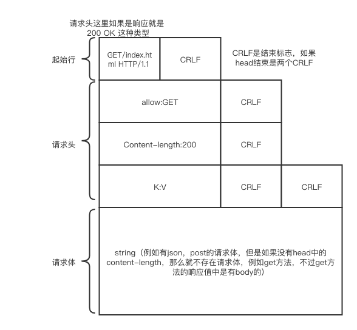

# HTTP协议
## 常用的http状态码
|状态吗|作用|
|:---:|:---:|
|200|最常见的一个code，表示可以访问，或者说是正常访问|
|201|post方法创建资源的方法，创建成功后返回201|
|202|这个code表示异步请求，跟nodejs的那个机制很像，就是服务器直接返回一个标志，然后并没有实际的东西，实际的东西需要等待回调函数|
|301|永远重定向，意思就是只有在第一次才请求服务器，之后都不会请求服务器直接请求浏览器中的缓存，除非删除浏览器中的缓存|
|302|302是暂时重定向，一般比如引入微信登陆啊，微博登陆啊，用这个，因为它每次的重定向都会再次询问服务器|
|304|这个标志是指，http的if-none-match 匹配成功了，然后浏览器直接将浏览器中的缓存给了用户，而不再去访问服务器了|
|400|参数验证失败|
|401|用户的权限不够|
|403|一般就是你被拉入黑名单之类的，你被服务器禁止掉了|
|404|找不到资源|
|413|客户端上传的照片资源太大|
|414|客户端的url过长，导致服务器无法去识别了。|
|500|服务器内部错误|
|502|服务器挂掉|

总之2xx就是好事，3xx就是重xx之类的问题，4xx就是找不到什么什么之类的，或者说就是客户端出问题5xx就是服务器端错误。
## HTTP协议头大全
｜协议头｜作用｜
｜:---:|:---|
|Accept||
|Accept-Charset||
|Accept-Language||
|Content-Language||
|Content-Length||
|Content-MD5||
|Date||
|Age||
|Expires||
|ETag||
|if-Match||
|if-None-Match||
|Allow||
|Connection||
|From||
|Host||
|Last-Modified||
|if-Modified-Since||
|if-Unmodified-Since||
|Range||
|Content-Range||
|if-Range||
|Location||
|Max-Forwards||
|Pragma||
|Referer||
|Retry-After||
|Server||
|User-Agent||
|Transfer-Encoding||
|Upgrade||
|Vary||
|Via||
|Warning||
|WWW-Authenticate||
|Authorization||
|Proxy-Authenticate||
|Proxy-Authorization||
|Cache-Control||
### ETag Last-Modified Expires 的区别

## HTTP各种方法
|方法|作用|
|:---:|:---:|
|GET|用的最多，就是请求资源的意思|
|POST|创建资源（标准就是只是创建，但是我们一般也可以更改）application/x-www-form-urlencoded：提交数据表单时经常使用，Body内部存放的是转码后的键值对。application/json提交结构化表单时使用，Body内部存放的是JSON字符串。multipart/form-data 上传文件时经常使用。这种格式比较复杂，它是为了支持多文件上传混合表单数据而设计的一种特殊的格式|
|PUT|正儿八经的修改资源，put会覆盖效果，举个例子，你发一个子第一次发a第二次发b，那么只有b被留下了，a不见了，但是post，ab都在，所以这就是为什么post才是增加，而put是修改，而且还有一点需要注意，每次put需要put所有的参数，不然覆盖后有些没写的参数就是nil了|
|PATCH|它跟put对应，也是修改资源，但是它是可以修改部分资源的，就是参数可以不带起。|
|DELETE|删除资源|
|HEAD|类GET,就是返回的只有head的内容没有body的内容|
|OPINION|跨域请求的时候使用，用于获取这个url对应的相关的method这个是添加一个allow标签然后后面跟着 例如 allow:GET|
|TRACE|类似shell命令中的trace命令，获取资源在服务器中走动的各个流程的信息|
|CONNECT||
## http协议的真容

## 分块传送
当服务器向客户单传送动态资源的时候就会一块一块的传送，这个时候的传送就是一个thunk外加它的大小传给前端,分块传送需要在请求头增加一个特殊的键值对`transfer-encoding: chunked`

 下面这部分就是消息体的显示，也就是将普通的string改成了这种形式。

## 持久连接
1.0之前如果不配置keep-Alive那么就是连接一次断一次，然后1.1一周 这个所谓的长链接就成默认的了。
KeepAlive Timeout参数和KeepAlive Requests参数限制单个连接持续时长和最多服务的请求次数。
如果timeout就是0，那么就OK了，直接退化为连接一次就断一次的行为了。非持久连接会在响应头部增加一个头信息Connection: Close通知客户端在接受完当前响应后连接需要立即关闭。所以说浏览器如果看到服务器发送给自己的信息里timeout不是0，那么它就会按照这个时间去长链接一会，如果看到了有head中有close，那么就直接关闭了。假如timeout服务器设置的过长，那么浏览器得到这个timeout的时候也不会认可的，因为它自己也有一个max的限制。
## pipeline管线化
在之前没有管线化的时候，即使读一个响应一个，每次响应就会浪费一个ttl然后呢后来改了，就是使用了一个队列，把所有的连接请求都搞在一起，然后再读取他们。通过队列，就能得到先来的先处理，顺序也是一致的。这样就可以一次好多个才用了一个ttl。
## 无状态性
HTTP协议本身是无状态的，它并不会为不同的连接做区分，在http协议看来都是一样的，都是连接，所以我们要在应用层上做区别呀
也就是cookie-session机制了。
## 如果不实用https，如何保证http协议传输过程的安全性
主要由于http协议是一个可见的，不安全的协议，任何的内容都是暴露的，所以我们通常要使用https，http+tls证书的方式
所以这个问题的核心就是加密或者说是内容的不可见。

我们可以才用非对称加密，整个的过程是这样的，首先我们需要一对一对的公钥和私钥，然后为了节省动态生成这对的时间，我们搞一个公钥丝钥的池子，也就是说我们一次生成一堆，然后每次用的时候去池子里取就好，定期更新池子即可。这样一动态生成了，安全性有了很大的保证，而来通过池子的效应，也提高了不少的效率。通过每次发送加密过的用户名和密码再加上公匙，然后使用例如hash表来查询到它的对应的私匙，这样就可以做到加密信息的效果了。
> 与之相对应的是对称加密，就是只有一个钥匙，这种方法效率高，解码的速度快，但是不够安全，因为你把私钥也发出来了，一般我们都是对称和非对称结合，也就是说让公钥去加密对称加密中的密匙，这样的化安全性有了保证，而且对称加密中的信息也少，这样公匙私匙加解密速度快了很多啊，然后对称加密中的钥匙再一解密，这样就是速度和安全并存了。

## 文件路径攻击
文件路径攻击就是 `..`攻击，我们都直到大多数的系统中 .. 都是表示上一层，那么假如我们的服务器没有防范这个符号，然后黑客在访问我们的服务器的时候，输入了很多.. 举个例子把，假如我们有个路由是 xx/name 然后黑客给我们的信息是 xx/name/::/::/::/xxx如果是你要把某个路径的东西给用户，你代码中使用了 getpath("url") =》黑客的：getpath("../../../../")假如用户使用了这种URL你可能把根路径都给用户了。我们要做的就是检查来袭的URL看看是不是有.. 有..一律过滤掉
## DNS 欺骗
DNS欺骗，DNS劫持，说的都是一种东西，http协议是无法直接使用pathname来通信的，我们必须获取到pathname对应的ip才可以通信，那么我们是如何获取ip的呢，答案就是dns，举个例子，我们访问谷歌，其实我们是拿google.com -> DNS 服务器 ，dns服务器查询到google对应来xx.xx.xx.x的ip地址，然后将这个ip返回给http协议，http才能看到实际的ip然后再根据这个ip去请求服务器。所以dns服务其实是为了辅助http协议这个傻白甜的，因为http真的不认识pathname啊。她只认识ip。

那么好了，我作为一个黑客我将你电脑里或者手机里的dns信息给你更换了，本来你用的8.8.8.8,然后人家是正规的dns解析服务，然后都没问题，然后呢，我黑客，给你返回错误的IP，以此赚你的广告费，或者就是做一个李鬼的网站盗取个人信息。解决方法即使加速dns服务器的缓存时间，让它的缓存短一点。
## 外部http代理
外部http代理就是请求和服务器中间的中间服务器或者叫中间节点，如果这里做手脚很容易就倒霉了。
## cookie
一般我们在cookie中存的都是session的session_id这些id跟session一一对应，因为cookie是存在用户本地的，所以很容易被盗走，我们可以使用https避免信息被套走，也可以服务器动态生成一些跟这个客户浏览器有关的东西，比如这样，本地上传一个时间给服务器，然后本地也记录，这样下次在传递过来session_id的时候把这个记录也发过来，一致的化就证明是正常的，否则就是假冒的。

- Set-Cookie 这是cookie设置的时候的设置参数，意思就是只能被https访问，http不行
- httpOnly 这个意思就是不能被js获取，只能由http浏览器使用。

这两个参数设置好也能做一定的防护。
## CSRF
跨站请求伪造，意思就是给你一个URL，诱导你去做某件事，不如删了自己的文章 http://example.com/blog/123456/delete 假如又一个图片，然后它上面有这个URL，这个删除刚好是要看你的cookie中的session——id然后再去服务器验证身份的，刚好是你自己点击的，那么系统就判断你是真的想删除啊，然后就删了呗，这就是跨站请求伪造。

黑客在别的什么网站上伪造了一个POST表单，诱惑你去submit。如果只是普通的内嵌进HTML网页的表单，用户提交时会出现跨域问题。因为当前网站的域名和表单提交的目标域名不一致。但是如果通过iframe来内嵌表单，则可以绕过跨域的问题，而用户却完全没有任何觉察
`<input type="hidden" name="csrf_token" value="xxxxxxxxxxxx">`设置这个隐藏的条件就可以验证了，避免了csrf，它生成的时候就是你服务器给它的，然后你服务器记录好了，然后它提交表单的时候就会把这个信息再发过来你验证一下正确就OK了，如果不正常就是攻击。这个过程我说一下 首先比如你get打开一个页面的时候，这个时候服务器就会动态的渲染html，这个时候这个隐藏的inpu就应被渲染好了，同时这个信息传入数据库，然后你再提交表达的时候这不就是验证了吗。

## XSS
跨域脚本，这个跟上面那个不同，上面那个的核心是诱骗你自己当黑客，就是用你的session_id然后用黑客的URL去做坏事，xss是某个黑河当自己是用户，它在里面植入了js代码，假设是输入信息的，那么它输入了js代码，如果你对js不作转义的化，就会对你攻击了，但是你转译一下就不会有问题了。

总结一下，csrf是黑客骗的是普通用户，通过你自己的钥匙去打开你家的门然后盗走东西，xss是黑河假装自己是客户，然后把病毒撒到服务器中。这是不同的。
## 跨域请求
服务器一般是禁止跨域请求的，因为如果这样的化，完全可以把某个用户的信息搞过来，然后你通过b站点获取他的个人信息。当然你或许会说我们仿造用户不就行了，这样就是csrf了，我们使用一个隐藏标签可以处理这个，所以一般服务器是禁止跨域的请求的，不让你使用他们的内部API，不过如果我们内部想访问怎么办呢？首先可以设置白名单，假如不设置白名单的话，我们也可以使用一个中转，比如你有三个域名服务 a.xx.com b.xx.com 然后统一用xx.com 做转发（可以使用nginx）。
- jsonp

这种方法就是内置在页面有个js标签，里面可以定时把数据返回或者发送给xx地址。不过呢，这也需要服务器同意才可以，服务器必须将数据以javascript代码的形式返回才可以传递给浏览器

缺点：只能get 不能发送cookie
-  CORS
cores使用ajax进行跨域请求，它什么都可以发，cookie也OK。服务器一般要设置如果是简单请求，Ajax直接请求服务器。

服务器

会当成普通的请求直接返回内容，不同的是还会在响应头部添加几个重要的头部，其中最重要的头部是Access-Control-Allow-Origin: http://example.com  这里的就是允许的名单。可以设置多个，可以算白名单了，浏览器会根据这个数据去检查是否给让跨
值得说明的是就算请求的URL不是规定的，服务器也会发送，它不管这个，这个管理主要是浏览器，它规定信息是否让看，所以浏览器是很复杂的东西。浏览器的作用这里是不让脚本读到数据，所以跨域请求大多数都是ajax请求，如果是使用了一个get客户端去请求呢？
还能避免吗？答案是不能。只要这个客户端不能获取某个用户的cookie等信息就无所谓了。除非你主动提供（很多的内容分发就是这个原理去搞的嘛）

浏览器

浏览器会在跨域的ajax上发送一个Origin参数，指明当前请求的发起站点来源。服务器根据Origin参数来决定是否授权。【简单请求】
> 简单请求就是头部很少很简单的GET/HEAD/POST请求

如果是复杂请求，那么浏览器会使用opinions方法去发送ajax的信息给服务器，服务器收到信息后同意了再发送给浏览器，浏览器再去请求服务器。所以复杂请求浪费了一个3次握手以及连接的机会，因为这个连接立马就断了不是长链接。
