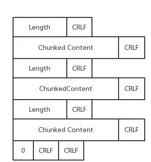

# HTTP协议
## 常用的http状态码
|状态吗|作用|
|:---:|:---:|
|200|最常见的一个code，表示可以访问，或者说是正常访问|
|201|post方法创建资源的方法，创建成功后返回201|
|202|这个code表示异步请求，跟nodejs的那个机制很像，就是服务器直接返回一个标志，然后并没有实际的东西，实际的东西需要等待回调函数|
|301|永远重定向，意思就是只有在第一次才请求服务器，之后都不会请求服务器直接请求浏览器中的缓存，除非删除浏览器中的缓存|
|302|302是暂时重定向，一般比如引入微信登陆啊，微博登陆啊，用这个，因为它每次的重定向都会再次询问服务器|
|304|这个标志是指，http的if-none-match 匹配成功了，然后浏览器直接将浏览器中的缓存给了用户，而不再去访问服务器了|
|400|参数验证失败|
|401|用户的权限不够|
|403|一般就是你被拉入黑名单之类的，你被服务器禁止掉了|
|404|找不到资源|
|413|客户端上传的照片资源太大|
|414|客户端的url过长，导致服务器无法去识别了。|
|500|服务器内部错误|
|502|服务器挂掉|

总之2xx就是好事，3xx就是重xx之类的问题，4xx就是找不到什么什么之类的，或者说就是客户端出问题5xx就是服务器端错误。
## HTTP协议头大全
｜协议头｜作用｜
｜:---:|:---|
|||
## HTTP各种方法
|方法|作用|
|:---:|:---:|
|GET|用的最多，就是请求资源的意思|
|POST|创建资源（标准就是只是创建，但是我们一般也可以更改）|
|PUT|正儿八经的修改资源，put会覆盖效果，举个例子，你发一个子第一次发a第二次发b，那么只有b被留下了，a不见了，但是post，ab都在，所以这就是为什么post才是增加，而put是修改，而且还有一点需要注意，每次put需要put所有的参数，不然覆盖后有些没写的参数就是nil了|
|PATCH|它跟put对应，也是修改资源，但是它是可以修改部分资源的，就是参数可以不带起。|
|DELETE|删除资源|
|HEAD|类GET,就是返回的只有head的内容没有body的内容|
|OPINION|跨域请求的时候使用，用于获取这个url对应的相关的method这个是添加一个allow标签然后后面跟着 例如 allow:GET|
|TRACE|类似shell命令中的trace命令，获取资源在服务器中走动的各个流程的信息|
|CONNECT||
## http协议的真容

## 分块传送
当服务器向客户单传送动态资源的时候就会一块一块的传送，这个时候的传送就是一个thunk外加它的大小传给前端,分块传送需要在请求头增加一个特殊的键值对`transfer-encoding: chunked`

 下面这部分就是消息体的显示，也就是将普通的string改成了这种形式。

## 持久连接
1.0之前如果不配置keep-Alive那么就是连接一次断一次，然后1.1一周 这个所谓的长链接就成默认的了。
KeepAlive Timeout参数和KeepAlive Requests参数限制单个连接持续时长和最多服务的请求次数。
如果timeout就是0，那么就OK了，直接退化为连接一次就断一次的行为了。非持久连接会在响应头部增加一个头信息Connection: Close通知客户端在接受完当前响应后连接需要立即关闭。所以说浏览器如果看到服务器发送给自己的信息里timeout不是0，那么它就会按照这个时间去长链接一会，如果看到了有head中有close，那么就直接关闭了。假如timeout服务器设置的过长，那么浏览器得到这个timeout的时候也不会认可的，因为它自己也有一个max的限制。
## pipeline管线化
在之前没有管线化的时候，即使读一个响应一个，每次响应就会浪费一个ttl然后呢后来改了，就是使用了一个队列，把所有的连接请求都搞在一起，然后再读取他们。通过队列，就能得到先来的先处理，顺序也是一致的。这样就可以一次好多个才用了一个ttl。
## 无状态性
HTTP协议本身是无状态的，它并不会为不同的连接做区分，在http协议看来都是一样的，都是连接，所以我们要在应用层上做区别呀
也就是cookie-session机制了。
## 如果不实用https，如何保证http协议传输过程的安全性
主要由于http协议是一个可见的，不安全的协议，任何的内容都是暴露的，所以我们通常要使用https，http+tls证书的方式
所以这个问题的核心就是加密或者说是内容的不可见。

我们可以才用非对称加密，整个的过程是这样的，首先我们需要一对一对的公钥和私钥，然后为了节省动态生成这对的时间，我们搞一个公钥丝钥的池子，也就是说我们一次生成一堆，然后每次用的时候去池子里取就好，定期更新池子即可。这样一动态生成了，安全性有了很大的保证，而来通过池子的效应，也提高了不少的效率。通过每次发送加密过的用户名和密码再加上公匙，然后使用例如hash表来查询到它的对应的私匙，这样就可以做到加密信息的效果了。
> 与之相对应的是对称加密，就是只有一个钥匙，这种方法效率高，解码的速度快，但是不够安全，因为你把私钥也发出来了，一般我们都是对称和非对称结合，也就是说让公钥去加密对称加密中的密匙，这样的化安全性有了保证，而且对称加密中的信息也少，这样公匙私匙加解密速度快了很多啊，然后对称加密中的钥匙再一解密，这样就是速度和安全并存了。

## 文件路径攻击
文件路径攻击就是 `..`攻击，我们都直到大多数的系统中 .. 都是表示上一层，那么假如我们的服务器没有防范这个符号，然后黑客在访问我们的服务器的时候，输入了很多.. 举个例子把，假如我们有个路由是 xx/name 然后黑客给我们的信息是 xx/name/::/::/::/xxx如果是你要把某个路径的东西给用户，你代码中使用了 getpath("url") =》黑客的：getpath("../../../../")假如用户使用了这种URL你可能把根路径都给用户了。
## DNS 欺骗

## 外部http代理

## cookie

## CSRF

## XSS

## 跨域请求

## jsonp

## CORS
