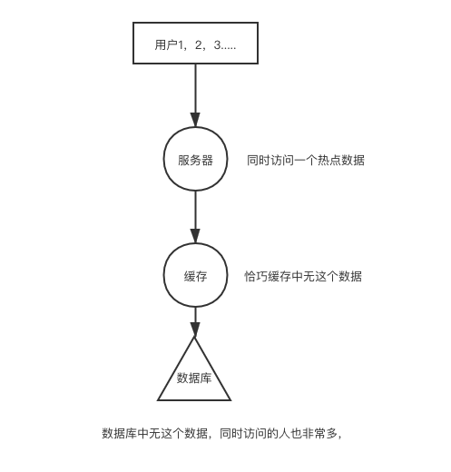
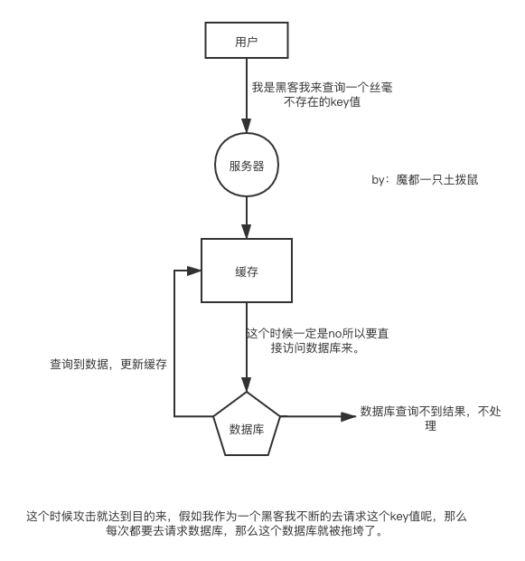

# 缓存雪崩的问题

在说明这几种情况的前提下说一下，任何使用了缓存的系统都要面临着数据一致性的问题，就算是再快的缓存也有可能跟数据库中的实际数据不一致，
所以说如果一个场景下的实际的数据要求一致性超级高，就别用缓存了。

雪崩的问题是 大面积的商品都过期了。


## 如何解决？

### 解决方法一 添加一个随机数

```go
// 伪代码
setRedisTime(time+random) // 时间+随机值
```
 我们都是设置不同商品的时候+一个随机数，那么数据库的压力就会小很多，这样就可以去避免雪崩的问题了。
### 解决方法二

我们可以将这个缓存设置为永不过期。
### 布隆过滤器

# 缓存击穿问题

## 如何解决

### 设置永不过期

我们可以在用户少的情况下更新这个缓存，然后设置这个缓存永不过期就OK了，比如在双十一来临的前5个小时更新了这个数据，然后设置缓存就不停止了，直到双十一过完。

### 设置互斥锁

我们将从缓存中查询不到数据开始谁知一个lock，然后直到更新完缓存中的数据结束锁开。这样只能有一个用户去进行缓存数据更新这个操作了。自然数据库的压力就小了

```go
if 缓存中没有数据{
  if 可以锁住 {
    去数据库中获取数据
   更新缓存
   开锁  
  }else{
  100ms后再次去查询缓存。  
  }
}
```


# 缓存穿透问题

## 如何解决？
我们其实应该把这个不存在的key也记录到缓存中，然后我们可以将这些有攻击倾向的key值设置一个比较短的过期时间。比如60秒
这样我们的数据库就不会被拖垮了。
```go
// 伪代码
if _,ok := map[k];!ok {
  setRedis(k,1,60s)// 将这个值不要忽略，设置的过期时间短一点即可。
}
```
